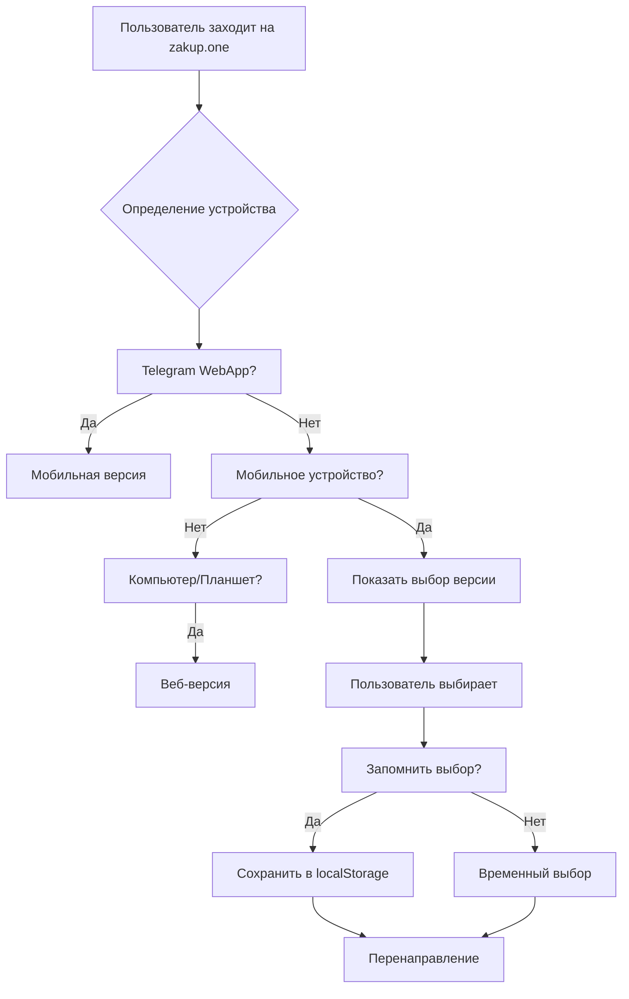

# 🤖 Автоматическое определение устройств - zakup.one

## 🎯 Обзор системы

Система автоматически определяет тип устройства пользователя и перенаправляет на оптимальную версию приложения:

- **📱 Мобильные устройства** → Telegram WebApp или мобильная веб-версия
- **💻 Компьютеры** → Веб-версия
- **📱 Планшеты** → Веб-версия
- **🤖 Telegram WebApp** → Мобильная версия

## 🔍 Алгоритм определения

### 1. **User-Agent Detection**
```javascript
const mobileRegex = /Android|webOS|iPhone|iPad|iPod|BlackBerry|IEMobile|Opera Mini/i;
const isMobileUA = mobileRegex.test(navigator.userAgent);
```

### 2. **Screen Size Analysis**
```javascript
const isSmallScreen = window.innerWidth <= 768;
const isMediumScreen = window.innerWidth <= 1024;
```

### 3. **Touch Capability**
```javascript
const hasTouch = 'ontouchstart' in window || navigator.maxTouchPoints > 0;
```

### 4. **Telegram WebApp Detection**
```javascript
const isTelegram = !!(window.Telegram && window.Telegram.WebApp);
```

## 🚀 Логика перенаправления

### **Сценарий 1: Telegram WebApp**
- ✅ Остается на мобильной версии
- ✅ Полный доступ к Telegram API
- ✅ Оптимизированный интерфейс

### **Сценарий 2: Мобильное устройство (не Telegram)**
- 🔄 Показывает модальное окно выбора
- 📱 **Telegram версия** - рекомендуется
- 💻 **Веб версия** - полнофункциональная

### **Сценарий 3: Компьютер**
- 🔄 Автоматическое перенаправление на `/web-version.html`
- 💻 Полнофункциональный интерфейс
- 🖱️ Оптимизация для мыши и клавиатуры

### **Сценарий 4: Планшет**
- 🔄 Автоматическое перенаправление на `/web-version.html`
- 📱 Адаптивный дизайн для больших экранов

## 🎨 Пользовательский интерфейс

### **Модальное окно выбора (мобильные устройства)**
```html
<div class="device-choice-modal">
    <div class="modal-content">
        <h3>Выберите версию приложения</h3>
        <button class="version-btn telegram-btn">
            📱 Telegram версия (рекомендуется)
        </button>
        <button class="version-btn web-btn">
            💻 Веб версия (полнофункциональная)
        </button>
        <label>
            <input type="checkbox"> Запомнить выбор
        </label>
    </div>
</div>
```

### **Переключатели версий**
- **В мобильной версии**: Кнопка "Переключить версию" в заголовке
- **В веб-версии**: Кнопка "Мобильная версия" в заголовке

## 💾 Сохранение предпочтений

### **localStorage Keys**
```javascript
// Предпочтительная версия пользователя
localStorage.setItem('zakup-preferred-version', 'mobile|web|auto');

// Получение предпочтения
const preferred = localStorage.getItem('zakup-preferred-version') || 'auto';
```

### **Варианты предпочтений**
- `'auto'` - автоматическое определение (по умолчанию)
- `'mobile'` - всегда мобильная версия
- `'web'` - всегда веб-версия

## 🔧 Техническая реализация

### **Файлы системы**
- `device-detection.js` - основная логика определения
- `device-choice.css` - стили модального окна
- `index.html` - мобильная версия с автоопределением
- `web-version.html` - веб-версия с переключателем

### **Класс DeviceDetector**
```javascript
class DeviceDetector {
    constructor() {
        this.userAgent = navigator.userAgent;
        this.screenWidth = window.innerWidth;
        this.isTelegram = this.detectTelegram();
        this.deviceType = this.detectDevice();
    }
    
    detectDevice() { /* логика определения */ }
    shouldRedirect() { /* проверка необходимости перенаправления */ }
    redirect() { /* выполнение перенаправления */ }
    showDeviceChoice() { /* показ модального окна */ }
}
```

## 📱 Адаптивность

### **Мобильные устройства (≤768px)**
- Показ модального окна выбора
- Оптимизация для сенсорного управления
- Telegram WebApp интеграция

### **Планшеты (769px-1024px)**
- Автоматическое перенаправление на веб-версию
- Адаптивная сетка товаров
- Сенсорное управление

### **Компьютеры (>1024px)**
- Автоматическое перенаправление на веб-версию
- Полнофункциональный интерфейс
- Клавиатурные сокращения

## 🎯 Преимущества системы

### ✅ **Автоматизация**
- Пользователь не думает о выборе версии
- Оптимальный UX для каждого устройства
- Единая точка входа (https://zakup.one)

### ✅ **Гибкость**
- Возможность переключения версий
- Запоминание предпочтений пользователя
- Ручное управление при необходимости

### ✅ **SEO-дружелюбность**
- Правильные мета-теги для каждого устройства
- Адаптивные иконки и описания
- Оптимизация для поисковых систем

### ✅ **Производительность**
- Быстрое определение устройства
- Минимальная задержка перенаправления
- Кэширование предпочтений

## 🔄 Поток работы



## 🚀 Готово к использованию!

Система автоматического определения устройств полностью реализована и работает на сервере **zakup.one**:

- ✅ **Автоматическое определение** устройств
- ✅ **Умное перенаправление** пользователей  
- ✅ **Модальные окна выбора** для мобильных устройств
- ✅ **Переключатели версий** в интерфейсе
- ✅ **Сохранение предпочтений** пользователей
- ✅ **Адаптивный дизайн** для всех устройств

**Пользователи теперь автоматически попадают на оптимальную версию приложения!** 🎊
